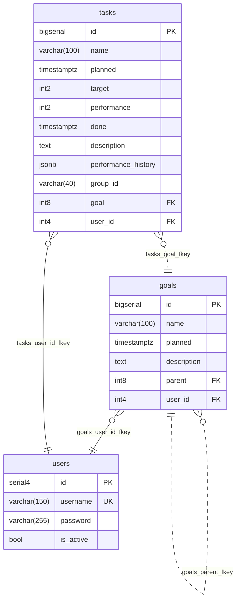

# goals-fastify

Fastify backend for [lifetrackerbuddy.com](https://lifetrackerbuddy.com/), an application to manage [OKRs](https://wikipedia.org/wiki/Objectives_and_Key_Results). It is an advanced task manager with main focus on the goal, goal achievement, and current progress. It should answer the question: _"How far am I away from achieving my goals?"_ Paired with the [Vue frontend](https://github.com/konskarz/goals-vue).

## Overview

- Fastify server handles routing and business logic
- PostgreSQL stores users, goals, and tasks

## Features

- REST API for managing users, goals, and tasks
- User management with authentication
- Tasks and goals scoped to the authenticated user
- Relational data model: users → goals → tasks
- Nested goals via parent reference
- Recurring tasks with batch creation, update, and deletion
- Deployable on Vercel with Neon

## Details

- Full CRUD with relational integrity and cascading updates/deletes
- JSON Schema validation for all endpoints
- Timestamps for scheduling and lifecycle tracking
- Demo user reseeded with sample data on login
- Database migrations with `Postgrator`
- Auto-generated [API docs](https://goals-fastify.vercel.app) with `Swagger`

## Data



## Setup

- Install [PostgreSQL](https://www.postgresql.org/download/)
- Create a new database
- Create `.env` & `.postgratorrc.json` to store sensitive configuration values

```
npm install
npx postgrator
npm run dev
```

## Deploy DB

- Log in to [Neon](https://neon.tech/) account
- Set up a new project
- Create a new Database
- Add tables using the Neon SQL Editor

## Deploy API

- Log in to [Vercel](https://vercel.com/) account
- Set up a new project
- Import Git Repository
- Set Environment Variables
